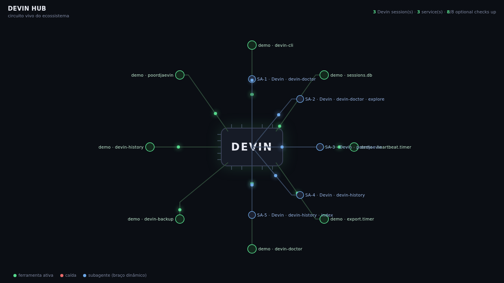

<div align="center">


<a href="https://github.com/Icaro0310/devin-office/actions/workflows/tests.yml"></a>


<a href="https://scorecard.dev/viewer/?uri=github.com/Icaro0310/devin-office"></a>
<a href="LICENSE"></a>
<a href="https://www.python.org/"></a>
<a href="https://github.com/Icaro0310/devin-office"></a>
<a href="https://github.com/Icaro0310/devin-office/commits/main"></a>
<a href="https://github.com/Icaro0310/awesome-devin"></a>
<a href="https://github.com/Icaro0310/devin-office/issues"></a>
</div>

# Devin Office

> Unofficial community tooling for Devin. Not affiliated with, endorsed by, or
> sponsored by Cognition AI. Devin is a Cognition AI trademark.
>
**[Linux](README.linux.md)** · **[Personal Windows](README.windows.md)** · **[Corporate Windows](README.corporate-windows.md)**

Part of the [awesome-devin](https://github.com/Icaro0310/awesome-devin) ecosystem: the curated hub for the devin-* tools.

A local-first dashboard of active Devin CLI/Desktop sessions and subagents. It
reads Devin's session database read-only and renders activity in a browser. Run
it on the Devin machine, or send state from a local probe to a private hub.

The current renderer is an SVG circuit view, not a pixel-art sprite renderer.
The sprite assets and generator scripts are optional development material; the
runtime dashboard does not require them.

## Preview



Demo page (synthetic sample data): [icaro0310.github.io/demos/devin-office.html](https://icaro0310.github.io/demos/devin-office.html)

## What runs

| Component | Purpose |
|---|---|
| `daemon.py` | Reads the local `sessions.db` read-only and serves `/api/state` plus the dashboard. Standalone mode; no tunnel or remote server. |
| `probe.py` | In split mode, polls local state and sends updates to a hub only when state changes. Remote controls are disabled by default. |
| `hub.py` | Serves the dashboard, receives probe state, and exposes health/state endpoints. It binds to loopback by default. |
| `executor.py` | Optional ACP control process for message/spawn/kill requests. Requires an authenticated Devin CLI and explicit opt-in. |
| `index.html` | Self-contained SVG dashboard; no JavaScript/CSS build step. |
| `swapmon.py` | SwapFile Queue collector (Linux `/proc`, read-only): swap totals, page-in/out rates and the per-process swap queue. |

An optional `OFFICE_ECO_URL` can supply a separate ecosystem-status JSON payload.
There is no default dependency on another dashboard or maintainer service.
Scheduled one-shot jobs in that payload (e.g. `cron_restart` entries that sit
`stopped` between runs) render with a ⏰ marker and count as healthy, not down.

### SwapFile Queue

On Linux, the dashboard shows a live **SwapFile Queue** panel (bottom-right):
swap used/total, page-in/out rates in kB/s, and the processes with the most
memory parked in swap, ranked by `VmSwap`. Processes that are OOM-immune
(`oom_score_adj <= -900`) are marked with a green dot. The panel hides itself
on hosts without `/proc` (e.g. Windows).

## Requirements

- Devin Desktop or Devin CLI installed on the machine whose sessions you want
  to observe.
- Python 3.10 or newer. The dashboard, probe and hub use the Python standard
  library; no `pip install` is needed.
- The `devin` CLI on `PATH` is required only for the optional ACP executor.

## Quick start: one machine

This read-only mode is the simplest way to try the dashboard. From a clone of
this repository:

**Windows (PowerShell):**

```powershell
git clone https://github.com/Icaro0310/devin-office.git
cd devin-office
py -3 daemon.py --port 8788
```

**Linux:**

```bash
git clone https://github.com/Icaro0310/devin-office.git
cd devin-office
python3 daemon.py --port 8788
```

Open `http://localhost:8788`. Stop the server with `Ctrl+C`. It binds to
loopback and does not write to Devin's databases.

## Devin data locations

| Store | Windows | Linux |
|---|---|---|
| `sessions.db`, `session_locks/` | `%APPDATA%\devin\cli\` | `$XDG_DATA_HOME/devin/cli/` (default `~/.local/share/devin/cli/`) |
| ACP message DBs, `state.vscdb` | `%APPDATA%\Devin\User\` | `$XDG_CONFIG_HOME/Devin/User/` (default `~/.config/Devin/User/`) |
| `credentials.toml` (executor only) | `%APPDATA%\devin\` | `$XDG_DATA_HOME/devin/` (default `~/.local/share/devin/`) |

`OFFICE_DATA_DIR` and `OFFICE_CONF_DIR` override the data and UI-config roots.
Use them when Devin was installed with non-default XDG locations.

## Works with Devin alone (Devin-only mode)

The standalone mode above is the whole product for a single machine: one
`daemon.py` process reads Devin's local stores and serves the pixel office on
`127.0.0.1:8788`. No VM, hub, tunnel or second machine is required — the
split mode below is strictly optional, for when *you* want a dashboard on a
different computer.

Security posture of standalone mode: loopback-only bind, read-only access to
Devin's databases, GET endpoints only, and cross-origin reads restricted to
loopback origins (set `OFFICE_CORS_ORIGIN` explicitly if a dashboard on a
different host/port legitimately needs to fetch `/api/state`).

## Split mode: local probe and private hub

Use this when the Devin machine should send session state to another computer
or server. The hub serves the page; the probe stays beside Devin's local data.

### Hub (Linux server)

The safe default is loopback. For remote access, bind only to a private
interface such as your VPN/Tailscale address, set a long random token, and
restrict port `8790` with your firewall:

```bash
export OFFICE_BIND='<private-interface-ip>'
export OFFICE_TOKEN='<same-random-secret-used-by-the-probe>'
python3 hub.py --port 8790
```

A non-loopback bind refuses to start without `OFFICE_TOKEN`. The hub uses plain
HTTP: keep it on a trusted private network or place it behind a correctly
configured TLS/authenticating reverse proxy. `/api/state` and `/api/health` are
readable to clients that can reach the bound interface; the token protects
POST ingestion and command requests, not those read endpoints.

### Probe (Windows PowerShell)

If the hub is reachable over your private network:

```powershell
$env:OFFICE_HUB = 'http://<private-hub-address>:8790'
$env:OFFICE_TOKEN = '<same-random-secret-used-by-the-hub>'
py -3 probe.py --interval 3
```

For a loopback-only hub, open an SSH tunnel in another terminal and set
`OFFICE_HUB` to `http://localhost:8790`.

### Probe (Linux)

```bash
export OFFICE_HUB='http://<private-hub-address>:8790'
export OFFICE_TOKEN='<same-random-secret-used-by-the-hub>'
python3 probe.py --interval 3
```

For a loopback-only hub, run `ssh -N -L 8790:127.0.0.1:8790 <user>@<server>` in
a second terminal and leave `OFFICE_HUB` at `http://localhost:8790`.

The probe transmits session metadata and tool activity to the configured hub.
Do not point it at a public or untrusted host.

## Optional session controls

Observation remains read-only. The hub's `message`, `spawn`, and `kill`
endpoints are **disabled by default**. To enable them, set
`OFFICE_CONTROL_ENABLED=1` on both hub and probe, keep the same
`OFFICE_TOKEN` on both, and use a private network. The local executor starts
`devin acp` using the authenticated Devin CLI. Never enable controls on a
publicly reachable endpoint.

## Configuration

| Variable | Default | Purpose |
|---|---|---|
| `OFFICE_BIND` | `127.0.0.1` | Hub listen address. A non-loopback address requires a token. |
| `OFFICE_TOKEN` | unset | Shared token for POST requests (`X-Office-Token`). Required for non-loopback hub binding. |
| `OFFICE_CONTROL_ENABLED` | disabled | Opt in to remote message/spawn/kill controls on hub and probe. |
| `OFFICE_HUB` | `http://localhost:8790` | Probe destination; `--hub` overrides it. |
| `OFFICE_INTERVAL` | `3` seconds | Probe poll interval; `--interval` overrides it. |
| `OFFICE_ECO_URL` | unset | Optional trusted endpoint returning ecosystem-status JSON. |
| `OFFICE_CORS_ORIGIN` | loopback only | `Access-Control-Allow-Origin` for `/api/state`. Defaults to loopback origins only; never `*`. |
| `OFFICE_DATA_DIR` | platform path above | Override Devin's CLI data root. |
| `OFFICE_CONF_DIR` | platform path above | Override Devin's UI-config root. |
| `OFFICE_DEVIN_EXE` | `devin` on `PATH` | Devin CLI executable for the optional executor. |
| `OFFICE_SPAWN_CWD` | repository parent | Working directory for spawned sessions. |
| `OFFICE_SPAWN_MODE` | `smart` | Mode ID for ACP sessions. |
| `OFFICE_PROMPT_TIMEOUT` | `900` seconds | ACP prompt timeout. |
| `OFFICE_SSH_HOST` | unset | SSH host alias for the Windows `up.pyw` tunnel. |
| `OFFICE_PORT` | `8790` | Local/remote port for the `up.pyw` tunnel. |

## Keep it running

- **Windows:** `up.pyw` is an optional split-mode supervisor. Set
  `OFFICE_HUB` for a reachable hub, or `OFFICE_SSH_HOST` to create a loopback
  SSH tunnel. Start it from Task Scheduler after defining the required
  environment variables for that user.
- **Linux:** run the probe under a user service manager such as `systemd --user`.
  Use an `EnvironmentFile` with permissions restricted to your user for
  `OFFICE_HUB` and `OFFICE_TOKEN`; do not put a real token in a committed unit
  file.
- **Hub:** use a service manager (systemd, PM2, or equivalent) and keep its
  bind/firewall policy private.

## Troubleshooting

- `sessions.db not found`: check the paths above or set `OFFICE_DATA_DIR`.
- GUI sessions absent: check `OFFICE_CONF_DIR`; the CLI database can still
  work by itself.
- `devin` not found: install/authenticate the Devin CLI or set
  `OFFICE_DEVIN_EXE`. This is needed only for controls.
- Hub rejects probe POSTs: confirm `OFFICE_TOKEN` is the same on both sides.
- No ecosystem-status nodes: that integration is optional; set
  `OFFICE_ECO_URL` only if you have a compatible status endpoint.

## License and credits

MIT — see [LICENSE](LICENSE). Furniture artwork is credited in the source; the
optional sprite-generation utilities are not required to run Devin Office.

## When to use this

- You run Devin CLI or Desktop on this machine and want one live view of all
  active sessions, subagents, and tool calls.
- You want a dashboard with zero install friction: Python 3.10+ stdlib only,
  no pip packages, no JS build step.
- You need a strictly read-only observer that never writes to Devin's stores.
- You want the board visible on a second machine over a private network
  (split probe + hub mode).

## When NOT to use this

- You need to search or analyze *past* sessions — devin-office shows live
  state; use `devin-search` or `devin-metrics` for history.
- You want remote session control out of the box — message/spawn/kill are
  disabled by default and require explicit opt-in on both ends.
- The machine has no Devin CLI/Desktop install — there is nothing to read.

## FAQ

**What is devin-office?** A local dashboard that renders your live Devin
sessions as an SVG circuit board in the browser. One `daemon.py` process reads
Devin's session databases read-only and serves the page on `127.0.0.1:8788`.

**Does devin-office send my session data anywhere?** No, in standalone mode.
Everything runs on loopback against your local Devin stores. The optional
split mode (probe + hub) sends session metadata only to a hub address you
configure; never point it at a public or untrusted host.

**Does devin-office need an API key or extra dependencies?** No. The
dashboard, probe, and hub use only the Python standard library. The `devin`
CLI is needed solely for the optional, opt-in executor that enables
message/spawn/kill controls.

**Can it change or kill my Devin sessions?** Only if you explicitly enable it.
Observation is read-only; the control endpoints are off by default and require
`OFFICE_CONTROL_ENABLED=1` plus a shared token on both hub and probe.


---

If this saved you debugging time, a ⭐ on the repo helps others find it.


`procmap.py` (OF-1) attributes running processes to Devin sessions:
`session_locks/*.lock` → owner PID → `/proc` process tree (+ RSS per
child) → `sessions.db`. Live vs dead locks, `--dead-only`, `--json`.
Read-only — nothing is signalled or killed; off-Linux falls back to
`tasklist`/`ps` with less detail. Tool-call attribution is lock-PID +
children inference (heuristic); container-level attribution is the
optional `devin-wisp` add-on.
